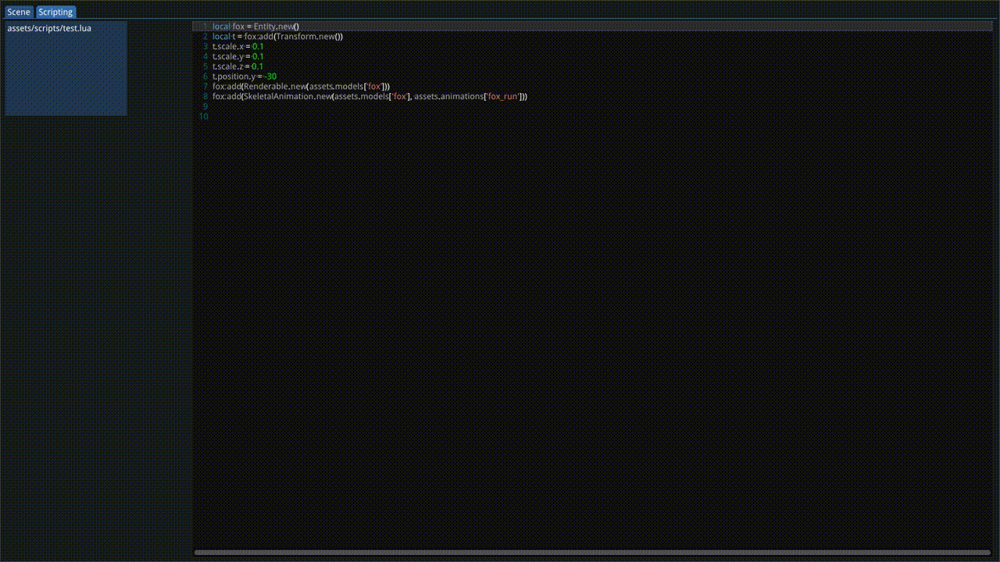

Mercury
=======

A work-in-progress game engine using Google's Filament as the renderer, Bullet for physics, LuaJIT for scripting, EnTT for entity component system management.

Only builds on Linux, and the process is, unfortunately, very finnicky. Working on it!

Example fox model made by [PixelMannen and tomkranis](https://github.com/KhronosGroup/glTF-Sample-Models/tree/master/2.0/Fox).
